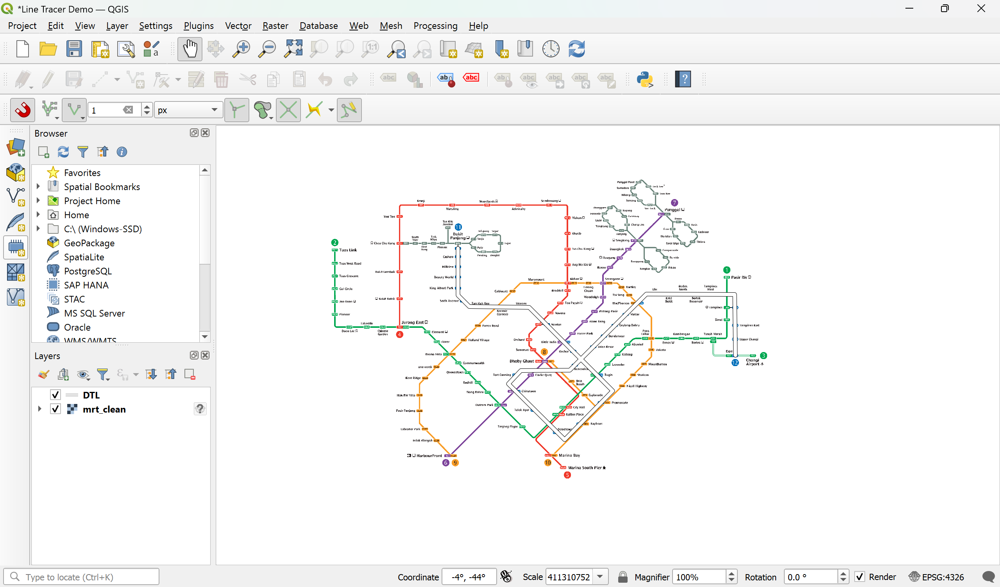
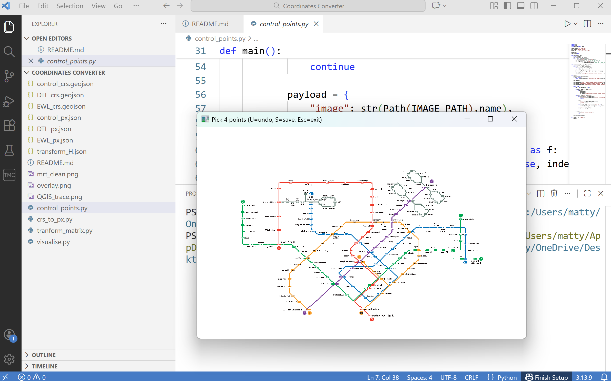
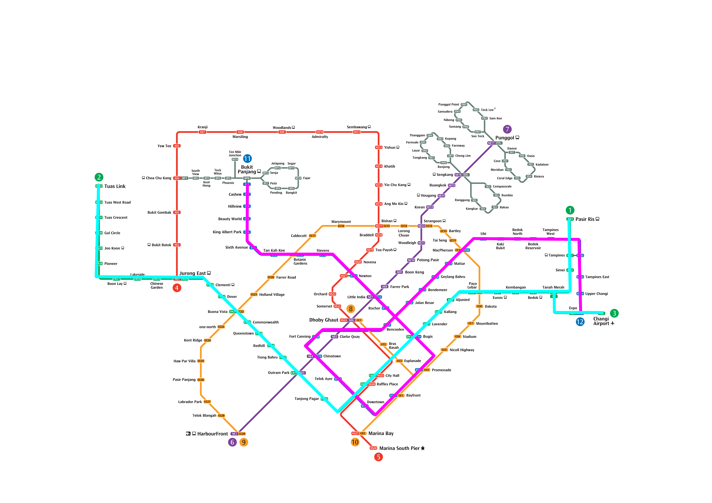

# Manual Line Extraction & Coordinate Conversion

The objective of this project is to develop a workflow for manually tracing line data and converting it into pixel coordinates that can be accurately overlaid onto the original schematic.

QGIS is selected as the tracing software because, while it does not directly output pixel coordinates for traced lines, its exported CRS coordinates remain anchored to the overall dimensions of the schematic. This preserves each traced line’s position relative to the entire schematic. Inkscape, on the other hand, produces vector layers whose coordinate system is constrained to the minimal bounding area of the path itself. As a result, these paths cannot be accurately mapped back to the complete schematic without additional context.

The central challenge of this project is therefore converting QGIS-exported CRS coordinates into image pixel coordinates without losing spatial accuracy. This repository addresses that challenge by deriving and applying an affine transformation matrix to map GIS space into pixel space consistently.

---

## Overview

The pipeline consists of 3 stages:

1. **Manual tracing in QGIS**  
   MRT lines are traced by hand over a schematic background image. The line data are represented as CRS coordinates and exported in GeoJSON format.  
   

2. **Produce control coordinates for each coordinate system**  
   Four reference control points are selected. Their CRS coordinates are obtained from QGIS and exported as GeoJSON, while the corresponding pixel coordinates are extracted from the image using Python and OpenCV and saved as JSON.  
   

3. **Matrix-based transformation**  
   A conversion matrix is derived to map CRS coordinates into pixel coordinates using an affine transformation. Given a set of corresponding control points in CRS space and image space, a linear system is solved to estimate the transformation parameters, including scale, translation, and axis inversion. Once computed, the same affine transformation matrix is applied uniformly to all traced line geometries, ensuring consistent CRS-to-pixel conversion without per-file recalculation. The transformed line data are then exported as JSON in pixel coordinates for downstream use.

---

## Final Result

The image below demonstrates the transformed line data overlaid correctly onto the original schematic:

---

## Limitations and Future Improvements

The accuracy of the CRS-to-pixel conversion depends entirely on the precision of the manually selected control points. The same four reference points must be identified both in QGIS (CRS space) and in Python using OpenCV (pixel space). Any discrepancy in these selections propagates directly into the estimated affine transformation matrix and affects the final alignment.

In the current implementation, four MRT stations distributed across the schematic are used as control points. Their pixel coordinates are obtained by manually clicking the approximate centre of the station code rectangles. This introduces small but unavoidable human error.

Future work could explore automating control point detection. This could further enhance the accuracy of the coordinate conversion.

